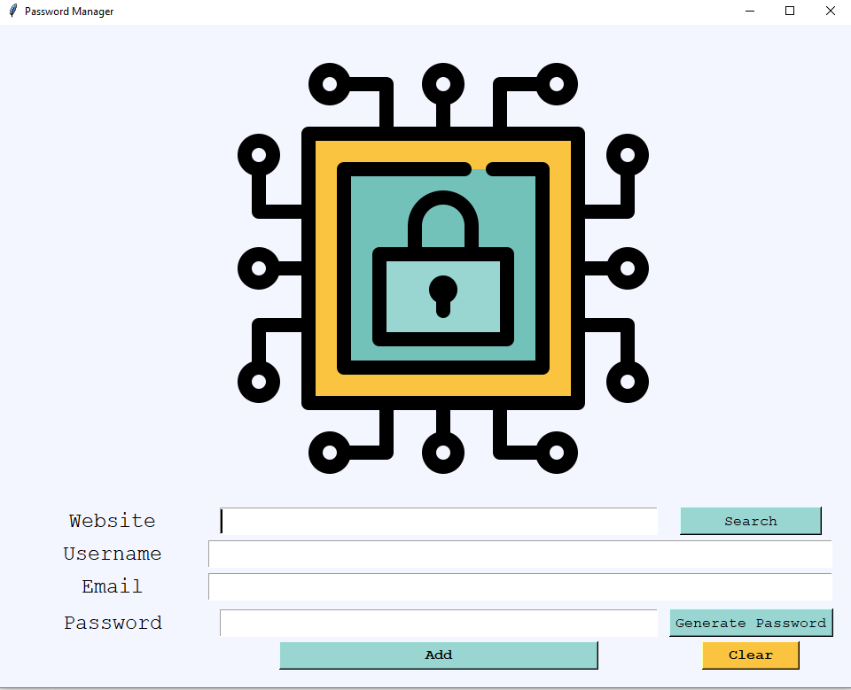

# 🔒 Password Manager - Tkinter

A secure desktop application for managing passwords, built with Python and Tkinter. Stores credentials locally in CSV format with easy search and generation capabilities.

 

## 🌟 Features
- 🔐 **Secure password generation** (8-16 chars with letters, numbers, symbols)
- 📂 **Local storage** (CSV format)
- 🔍 **Quick search** by website name
- 📋 **Auto-copy** generated passwords
- 🧹 **One-click clear** all fields
- 🎨 **Clean GUI** with intuitive controls

## 🛠️ Technologies Used
- Python 3
- Tkinter (GUI)
- Pandas (Data management)
- Pyperclip (Clipboard integration)

## 📦 Installation
1. Clone the repository:
```bash
git clone https://github.com/Juda-Tech-Green/password-manager.git
cd password-manager
```

2. Install dependencies:
```bash
pip install pandas pyperclip
python main.py
```
## 🎮 How to Use
1. **Add new entry:**
  - Enter Website, Username/Email.
  - Click "Generate Password" or type your own.
  - Click "Add" to save.
2. **Seasrch entries:**
  - Type website named and click "Search"
3. **Clear fields:**
  - Click "Clear" to reset all inputs

## 🖼️  UI Components
Element  | Description
------------- | -------------
Generate Button  | Creates strong random password
Search Button  | Retrieves saved credentials
Clear Button  | Resets all input fields

## ⚠️ Important Notes
- Data is stored in manager_data.csv (plaintext)

## 📜 License
MIT © Juda


